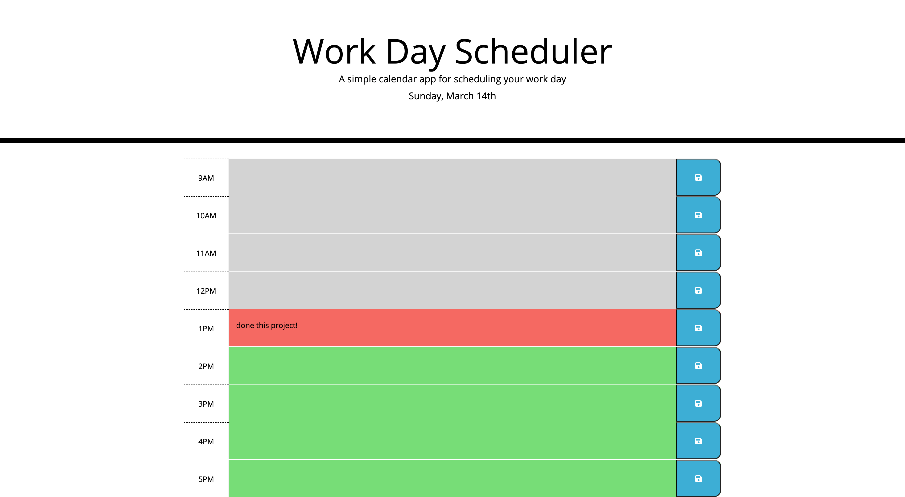

# Work-Day-Scheduler

## Approach 

To tackle this task of building a work day scheduler I first had to figure out what languages and frameworks I would need to use to make this a more manageable project. Luckily we were given starter code that was already linked to jQuery UI and CSS Bootstrap. This would make it much easier to layout the application in rows and columns that are responsive as Bootstrap has that built in. The jQuery would cut down on the vanilla JavaScript and take what might be 100+ lines of JS down to under 50 lines. I knew I would have to have a 3 column layout for each row with the main text area taking up the majority of the space (col-10) and the time and save button taking up one space each (col-1). The styles were given to us so I had to make sure each col was given the right corresponding class so that it matched the markup we were given. From there I moved onto the JavaScript, for this project I used jQuery almost exclusively along with some moment.js to help me get the current day and time. From there I was able to run a loop function to check if the current hour was past, present or future compared to the current hour in the scheduler. Past blocks will turn grey, present blocks are red and future blocks are green. This is all done with comparison operators. Next I had to ensure that the user could save their text to local storage and then retrieve that info so it would be displayed on the users browser when the page was refreshed. For this I used an on click function to know when the user clicked the save icon, this then set the items in local storage. Another function was then used to retrieve this info and display it in the text area. 

## Installation

To install this repo on your local drive you would have to clone the ssh key from my repo. Head into your local drive of choice in terminal or bash and do a git clone. Once you have done a git clone you are free to start working on this project. If you want to push your changes to my repo then you would have to head into terminal/bash and do a git add . Then a git commit -m explaning the changes made, and finally a git push to push the files onto the repo. 

## Finished project
My page is live on github!

https://mattrward1030.github.io/Work-Day-Scheduler/.

## Features
<ul>
<li>User can add important events to a daily planner so they are able to manage time effectively.</li>
<li>When the planner is opened the current day is displayed at the top of the calendar.</li>
<li>When the user scrolls down they are presented with timeblocks from 9 AM to 5 PM.</li>
<li>Each timeblock is color coded to indicate the time of day, past is grey, present is red and green is future.</li>
<li>Timeblock is clickable and a user can enter text into the field.</li>
<li>The text can be saved when the save icon is clicked.</li>
<li>The text is saved in local storage so that when the page is refreshed the saved text is still present on the screen.</li>
<li>This web page is comprised of three main files, a HTML, CSS, and JavaScript file.</li>
<li>The HTML houses all of the content that is then being styled with Bootstrap using column and row layouts. The classes and id's are then further styled in CSS.</li>
<li>The JavaScript file is almost entirely jQuery along with moment.js to be able to dynamically update the current day and current time.</li>
</ul>

## Tests
N/A

## Credits
N/A

## Contributing

Pull requests are welcome and encouraged. Hit me up on my github <a href="https://github.com/mattrward1030">mattrward1030</a>

## Badges
 

## License

MIT License

Copyright (c) [2021] [Matthew Ward]

Permission is hereby granted, free of charge, to any person obtaining a copy
of this software and associated documentation files (the "Software"), to deal
in the Software without restriction, including without limitation the rights
to use, copy, modify, merge, publish, distribute, sublicense, and/or sell
copies of the Software, and to permit persons to whom the Software is
furnished to do so, subject to the following conditions:

The above copyright notice and this permission notice shall be included in all
copies or substantial portions of the Software.

THE SOFTWARE IS PROVIDED "AS IS", WITHOUT WARRANTY OF ANY KIND, EXPRESS OR
IMPLIED, INCLUDING BUT NOT LIMITED TO THE WARRANTIES OF MERCHANTABILITY,
FITNESS FOR A PARTICULAR PURPOSE AND NONINFRINGEMENT. IN NO EVENT SHALL THE
AUTHORS OR COPYRIGHT HOLDERS BE LIABLE FOR ANY CLAIM, DAMAGES OR OTHER
LIABILITY, WHETHER IN AN ACTION OF CONTRACT, TORT OR OTHERWISE, ARISING FROM,
OUT OF OR IN CONNECTION WITH THE SOFTWARE OR THE USE OR OTHER DEALINGS IN THE
SOFTWARE.
